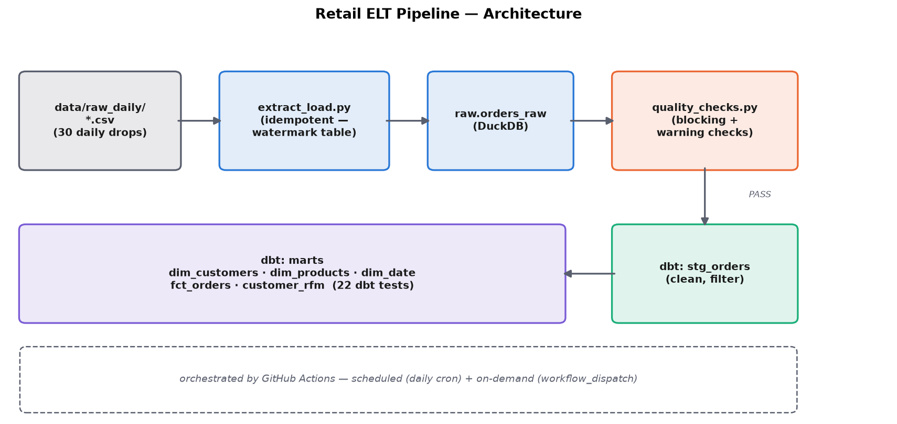

# Retail ELT Pipeline

**TL;DR:** An automated, idempotent ELT pipeline — daily raw order drops → DuckDB warehouse → data quality gate → dbt-transformed staging/marts layer with a 3-table star schema, 22 dbt tests, and a real CI/CD schedule via GitHub Actions. Same underlying retail dataset as [Project 1](../01-retail-customer-analytics/), rebuilt as a data engineering exercise instead of a data science one — the point here is the pipeline, not the analysis.

[📄 Full report](report.html) · [⚙️ GitHub Actions runs](https://github.com/wen11235/data-portfolio/actions/workflows/retail-elt-pipeline.yml) · [📓 Pipeline code](pipeline/) · [🔧 dbt project](dbt_project/)

## Why this exists

Every other project in this portfolio ends with a notebook or a report. A Data Analyst/Scientist workflow assumes the data is already clean and sitting in a table somewhere — a Data Engineer's job is making that true in the first place, reliably, on a schedule, without a human re-running anything by hand. This project demonstrates that specific skill set: extract/load, data quality gating, warehouse modeling, and orchestration — deliberately kept separate from any ML/analysis work.

## Architecture



1. **Source**: `data/raw_daily/*.csv` — 30 daily files (Dec 2010 – Jan 2011), each simulating one day's new-orders export from a source system. Generated once from [Project 1](../01-retail-customer-analytics/)'s dataset (`pipeline/generate_daily_drops.py`) and committed to the repo (~5MB) rather than depending on a live external API — see "A deliberate non-decision" below.
2. **Extract + load** (`pipeline/extract_load.py`): loads each daily file into `raw.orders_raw` in a DuckDB warehouse file, tracking what's already loaded in a `raw._pipeline_state` control table. Re-running the pipeline is safe — already-loaded batches are skipped, not duplicated (verified directly, see "Verification" below).
3. **Data quality gate** (`pipeline/quality_checks.py`): runs against the raw layer, split into **blocking** checks (schema correctness, no nulls in identifier columns, no empty batches, data landed in the right day's file — fail the pipeline) and **warning** checks (null CustomerID rate, negative-quantity rate, duplicate line items — logged, not blocking, because they're real and expected messiness in this dataset, not corruption).
4. **Transform** (`dbt_project/`, dbt-duckdb): a `stg_orders` staging model applies the actual cleaning rules (drop cancellations, missing CustomerIDs, non-positive quantity/price — same rules as Project 1's notebook, expressed in SQL instead of pandas), then a `marts` layer builds a star schema (`dim_customers`, `dim_products`, `dim_date`, `fct_orders`) plus a `customer_rfm` mart, all covered by 22 dbt tests (`not_null`, `unique`, `relationships`/referential integrity).
5. **Orchestration**: a GitHub Actions workflow (`.github/workflows/retail-elt-pipeline.yml`) runs the whole thing on a daily cron schedule and on-demand (`workflow_dispatch`), fails the job if any blocking check or dbt test fails, and writes a readable summary to the run page itself.

## A deliberate non-decision: no live external data source

The obvious "more realistic" version of this pipeline pulls from a live API. It doesn't, on purpose. Two free MySQL hosts used elsewhere in this portfolio ([ConcertNOW](../09-concert-trip-planner/)) both failed within about a week — one domain got hijacked, the other's account expired outright. A scheduled pipeline with a real external dependency inherits that same risk on a recurring basis, for a portfolio piece where the actual point is the pipeline logic, not the data source. The daily CSVs are committed fixtures instead — small (~5MB), version-controlled, and the pipeline code downstream doesn't know or care that they're static; swapping in a real API poll would be a contained change to `generate_daily_drops.py` alone.

## Verification

Everything below was actually run, not assumed:
- **Idempotency**: ran the pipeline twice in a row — second run: `0 new batch(es) loaded, 30 already loaded (skipped)`, row count unchanged (58,345).
- **Quality gate catches real corruption**: injected a row with a null `InvoiceNo` into a test batch — the gate correctly failed with exit code 1 and named the exact problem, before being removed again.
- **`--reload` path**: force-reloaded a single batch — row and batch counts unchanged afterward (no duplication, no data loss).
- **dbt build**: 5 models + 1 view, 22 tests, all passing (`PASS=28 WARN=0 ERROR=0`).
- **CI**: the GitHub Actions workflow runs the identical commands against a fresh checkout — see the [Actions tab](https://github.com/wen11235/data-portfolio/actions/workflows/retail-elt-pipeline.yml) for real, inspectable run history (not a screenshot).

## How to run it locally

```bash
cd projects/10-retail-elt-pipeline
python3 -m venv .venv && source .venv/bin/activate
pip install -r requirements.txt

python3 pipeline/extract_load.py       # idempotent — safe to re-run
python3 pipeline/quality_checks.py     # exits 1 on any blocking failure

cd dbt_project
DBT_PROFILES_DIR=. dbt build
```

## Skills demonstrated

ELT pipeline design, idempotent incremental loading (watermark/control-table pattern), data quality gating (blocking vs. informational checks, deliberately distinguished rather than treated as one undifferentiated list), dbt (staging/marts layering, schema tests, referential integrity), star schema warehouse modeling, DuckDB, CI/CD orchestration via GitHub Actions (scheduled + on-demand triggers, job summaries, `pipefail` correctness in piped shell steps), and a documented infrastructure-risk trade-off (no live external dependency, and why).
